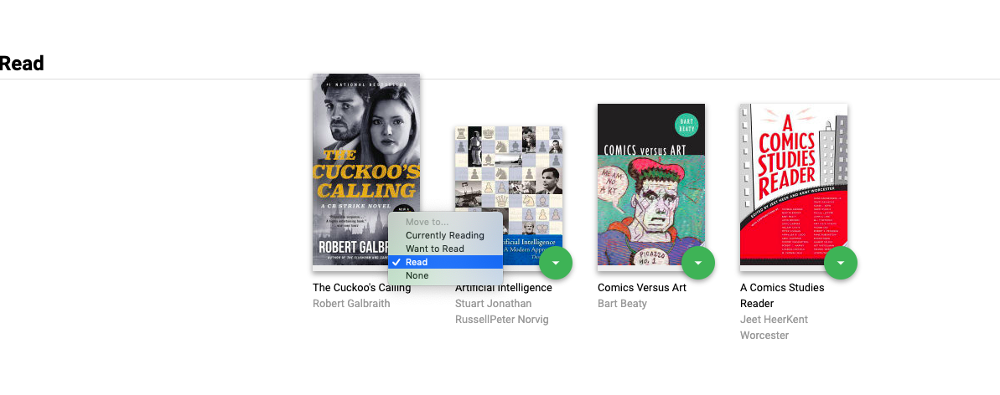

# MyReads Project

## Project Purpose:

This project was built for the Udacity React Nanodegree Program. 
It is the final assessment project for Udacity's React Fundamentals course.

## Project Overview:

In the MyReads project, we created a bookshelf app that allows the user to select and categorize books he has read, are currently reading, or want to read. The project emphasizes using React to build the application and provides an API server and client library that we used to persist information as the user interact with the application.

## Installing

Instructions to clone and run the project:
* clone the git project using `$ git clone https://github.com/Ameerahalshihry/reactnd-project-myreads-starter`
* install all project dependencies with `npm install`
* start the development server with `npm start`

## How to Use the App

* In this application, the main page displays a list of "shelves" (i.e. categories), each of which contains a number of books. The three shelves are:

  - Currently Reading
  - Want to Read
  - Read

  
* Each book has a control that lets you select the shelf for that book. When you select a different shelf, the book moves there. Note that the default value for the control should always be the current shelf the book is in.
  

* The main page also has a link to /search, a search page that allows you to find books to add to your library.
  

* The search page has a text input that may be used to find books. As the value of the text input changes, the books that match that query are displayed on the page, along with a control that lets you add the book to your library. When a book is on a bookshelf, it should have the same state on both the main application page and the search page.
  

## Resources and Documentation:

* [`React documentation`](#https://reactjs.org/docs/getting-started.html)

* [`React Router Documentation`](#http://knowbody.github.io/react-router-docs/)
* [`React Training/React Router`](#https://reacttraining.com/react-router/web/api/BrowserRouter)

## Author

* Ameerah Alshihry
